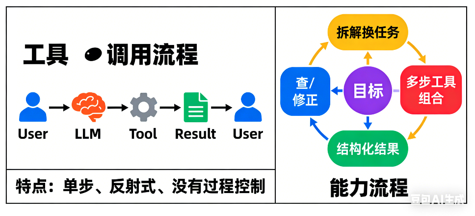
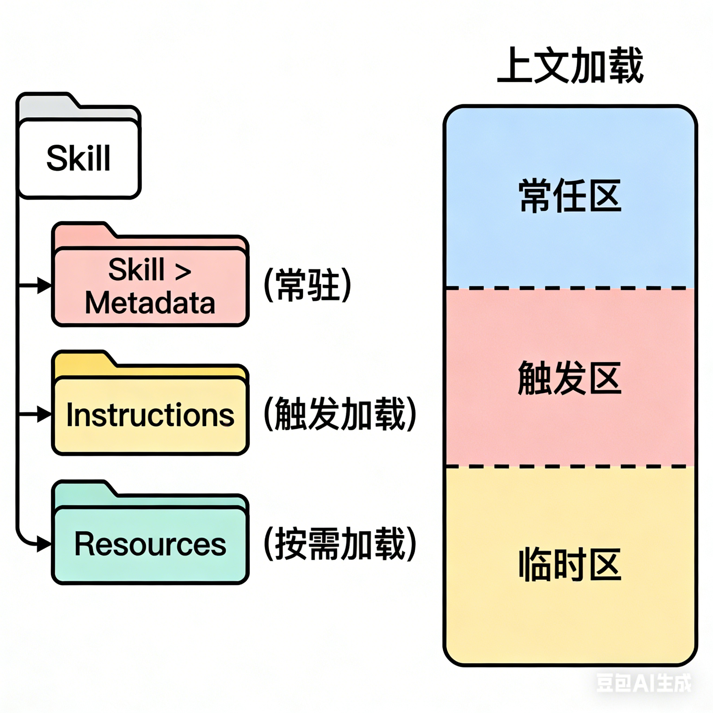

# Agent Skill不是银弹

最近，**Agent Skill**(下面简称Skill) 又引发了新一轮的狂热。人们寄希望于通过赋予大模型各种Skill，打造出能够自动完成复杂任务的超级工具。

然而，正如布鲁克斯在《人月神话》中所言：“没有万能的银弹。” **Skill同样不是银弹。** 仅靠堆砌Function Call、MCP、Skill，并不能解决AI落地中的本质困难。

## 技能的本质

**1.定义**
在 Claude 的体系中，技能是一类可复用的“专家能力模块”，通过文件夹结构的配置把专业知识、操作流程和执行指导打包，供 在遇到相关任务时自动加载使用。简单来说，技能让 Agent 不再“只会想”，而是真正“会做事”的能力模块。它不是某个 API，而是一整套可复用的“做事方法”。

**2. 为什么光有工具调用（Function call）不够？** 模型调用工具停在这一层：「模型判断 → 调一个工具 → 把结果返回」



这其实只是：**工具调用，不是能力。**

比如，调航班 API不代表会做旅游规划，会调用数据库不代表会做商业分析。
真正的能力，需要知道什么时候该查什么、查完如何筛选、信息冲突怎么办、怎么组合成结果、错了如何补救等。

所以工具只是解决了“调哪个接口”，而技能解决的是“怎么做成一件事。

**3. 技能与提示词/MCP的区别联系**

| 机制   | 提示词  | 技能           | MCP  |
| ---- | ---- | ------------ | ---- |
| 专业化  | 低    | 高            | 辅助连接 |
| 重复使用 | 不自动  | 自动           | 通信基础 |
| 内部结构 | 纯文本  | 指令 + 代码 + 资源 | 调用接口 |
| 自动触发 | 否    | 是            | 是    |
| 任务类别 | 单步任务 | 多步任务         | 工具接入 |

可以说MCP 是工具接入通道，Prompt 是用户意图表达，技能是任务执行指南。 其中技能和 MCP可以协作，MCP 提供能力合集，技能教 Agent 如何利用这些能力更智能执行任务。

**4. 技能的工作机制** 技能通常基于特定文件夹结构定义和使用，通常包含以下三类信息:

a. Metadata（元信息）

这类信息始终加载，里面的内容定义 Skill 名称、描述、用途，可以帮助 Agent 决定是否可能相关。

**示例：**

```yaml
---
name: pdf-processing
description: Extract text/tables from PDFs
---
```

这个部分就像技能“名片”，永久载入系统上下文里。

b. Instructions（指令内容）

当技能被触发时加载，包含具体执行步骤、工作流、示例。
它让 Agent 知道“遇到 PDF 文档该怎么做”而不是“你猜怎么做”。

c. Resources 
仅在需要时加载,可以包括脚本、模板、参考文档等。
这种设计叫 **Progressive Disclosure（渐进性披露）**，使Agent能装很多技能， 但不把所有内容一次性塞进上下文窗口，可以节省 token、提高效率。

技能文件夹层级结构示例：

```
my-skill/
├── SKILL.md       # 主说明与指令
└── resources/     # 相关资源，包括脚本、模版等
```



## 技能很强，但也很容易被高估

很多开发者认为，只要给 Agent 接入足够多的 技能（搜索、计算、绘图、数据库查询），它就能无所不能。这种“技能驱动”的思维存在两个误区：

- **编排的脆弱性：** 当任务变得复杂，Agent 需要进行多步推理（Reasoning）时，错误的累积会导致最终结果失控。一旦其中一个 Skill 的输出与预期产生微小偏差，整个任务链条就会像多米诺骨牌一样倒塌。

- **黑盒困境：** 仅仅拥有技能的 Agent 往往缺乏对环境的深刻理解。它只是在“机械地匹配”，而非“灵活地创造”。

## 幻觉与确定性的博弈

在企业级应用中，**确定性**高于一切。而基于大模型的 Agent 天生带有概率属性。

- **无法通过 Skill 消除的幻觉：** 即使 Agent 拥有查询数据库的技能，它仍可能在解读查询结果时产生幻觉，或者在选择调用哪个工具时发生误判。

- **成本与效率的失衡：** 为了提高准确率，开发者往往会引入复杂的 Self-reflection（自我反思）机制。这导致了 Token 消耗的剧增和响应延迟，在很多高频简单的业务场景下，反而不如传统的逻辑代码高效。

## 落地中的“最后一公里”难题

技能往往在演示（Demo）中惊艳，但在生产（Production）中拉胯。

现实系统里全是这些东西：

* 权限
* 并发
* 重试
* 审计
* 回放
* 回滚
* 异常兜底

这些事情，
目前的 Agent 框架**并不天然擅长**。

再加上：

* 长期记忆不稳定
* 上下文窗口有限
* 行为一致性难保证

## 一个更健康的定位

如果给 Skill 一个合理定位，它更像是**Agent 执行层的插件系统**

它的职责应该非常克制，比如：

✅把现实世界能力暴露出来  

✅提供稳定 I/O  

✅可监控、可替换、可回放

而不应该承担以下功能：

❌ 业务决策  
❌ 逻辑判断  
❌ 任务规划  
❌ 成败评估

这些东西，应该存在于技能之上的 Agent Core / Reasoning Layer / Control Layer。

## 从“技能堆砌”转向“系统工程”

Agent 绝不是简单的“LLM + Skills”，它的成功落地需要一套系统的工程化方案：

| **维度**   | **误区**              | **真相**                         |
| -------- | ------------------- | ------------------------------ |
| **核心能力** | 只要 API 够多，Agent 就够强 | 核心在于逻辑推理（Reasoning）与任务拆解       |
| **交互模式** | 完全自主，全自动化           | 人机协作（Human-in-the-loop）是现阶段的必然 |
| **评价标准** | 能否跑通 Demo           | 鲁棒性、可观测性与异常处理能力                |

**技能只是杠杆，而模型能力与工程架构才是支点。** 我们不应神化技能的作用，而应将其视为软件工程的一种新范式——它能处理模糊边界，但依然需要严格的边界约束。


