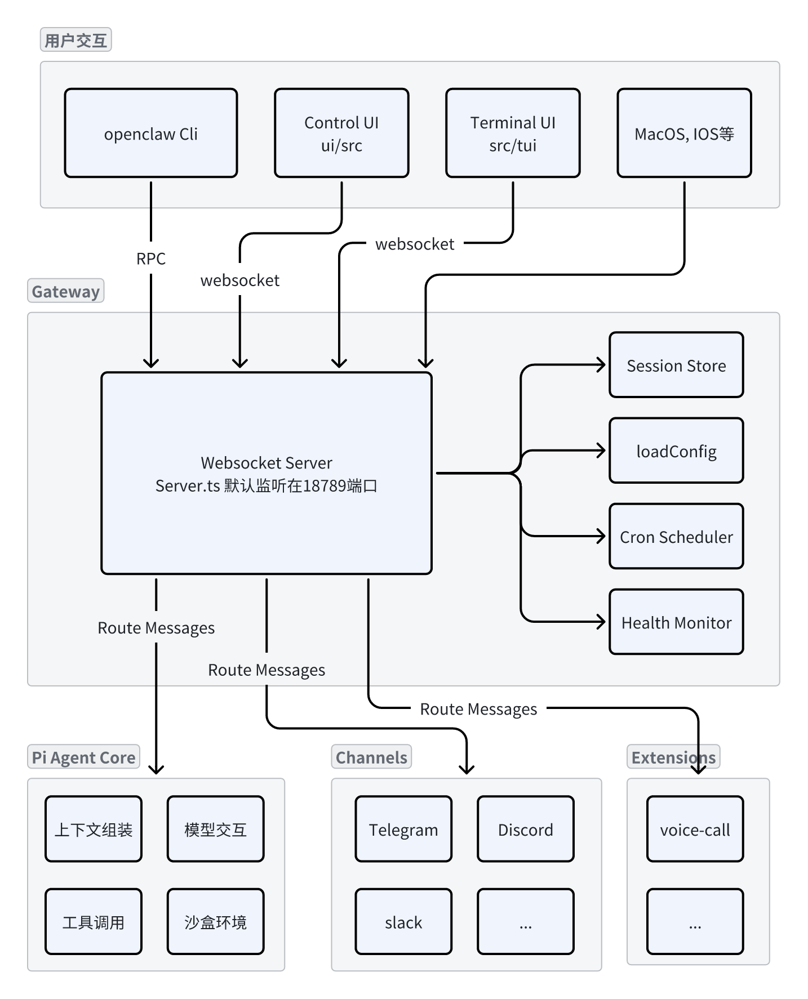

# 从 OpenClaw 看 AI 软件架构的新范式

## 一、什么是 OpenClaw？

OpenClaw 是一个**开源的自主 AI Agent 框架**。

它的名字几经更迭（Clawdbot → Moltbot → OpenClaw），但方向始终明确：

**构建一个可以长期运行、持续决策、主动执行的 AI 软件系统**。

它不是一个聊天机器人，也不是“LLM + API 封装”，而是一种**以 Agent 为中心的软件形态**：

- 能够接收指令、拆解任务、调用工具
- 能跨平台运行（本地设备 / 私有云）
- 能通过真实通信渠道（Telegram / WhatsApp / Signal 等）与世界交互
- 能记住过去，并据此调整行为

从软件架构角度看，OpenClaw 更像是一个**AI 时代的应用操作系统**，而不是一个 SDK。

**核心定位可以总结为三点：**

- **本地可自托管，数据主权完整**
  AI 不再默认运行在“别人的云里”。
- **具备 感知 → 推理 → 执行 → 反馈 的闭环行动能力**
  它不是一次性调用，而是一个持续运行的行为系统。
- **记忆、工具、插件是一等公民**
  OpenClaw 的功能不是写死在代码里，而是通过配置和扩展生长出来的。

## 二、架构设计

OpenClaw 的整体架构采用了一种**中心辐射型（Hub-and-Spoke）模型**。

核心不是 UI，也不是 API，而是一个名为 **Gateway** 的控制平面。

这里软件的中心，正在从“接口”转向“控制与协调”，主要包括以下几个部分。

### 1. Gateway 控制平面

Gateway 是整个系统的“神经中枢”。

- 它对外暴露 WebSocket 服务（默认 18789）
- 接收来自 CLI、Web UI、桌面端、移动端的连接
- 负责消息路由、会话管理、定时任务、健康监测

从源码结构上看，它并不关心“智能怎么做”，而是关心谁在和谁说话、状态是否一致、系统是否稳定运行。

> 启发：**把 AI 系统当成长期运行的服务，而不是函数调用。**

### 2. Agent Runtime —— 执行不是函数调用，而是循环

Agent Runtime 是 OpenClaw 最具代表性的部分。

它实现的不是“调用一次模型”，而是一个**完整的 Agent Loop**：

1. 接收来自渠道的消息
2. 解析会话上下文（私聊 / 群聊 / 历史记录）
3. 通过混合搜索加载相关记忆
4. 构建 Prompt，并与模型进行流式交互
5. 拦截工具调用，在沙箱中执行
6. 将结果反馈给模型，进入下一轮思考

这个流程本质上是 Reason → Act → Observe → Reason 的过程。

也就是说，**推理不是一步，而是一个反复收敛的过程**。

> 启发：在 AI 软件中，控制流正在从“函数调用栈”转向“行为循环（Behavior Loop）”。

### 3. 存储与状态管理

OpenClaw 的状态与行为定义，并不隐藏在代码深处，而是显式存在于 Workspace 中。

核心文件包括：

- **SOUL.md**：人格、原则、风格
- **AGENTS.md**：行为规范与记忆说明
- **TOOLS.md**：工具能力、边界与约束
- **BOOTSTRAP.md**：系统启动时的引导逻辑

这些文件看起来是 Markdown，但本质上是**结构化的行为配置**。这使得 AI 的“行为逻辑”由**可编辑、可审查、可版本化的数据**定义。

> 启发：AI 的行为逻辑，应该是“可编辑的数据”，而不是“写死的代码”。

### 4. 通讯渠道

OpenClaw 对每个通讯平台都实现了完整的适配层，而不是简单 webhook。

- Telegram、Discord、WhatsApp、Slack、Signal、iMessage……
- 所有消息统一进入同一套路由与权限系统
- 统一处理格式、附件、访问控制

这意味着 AI 并不依附于某个 UI，而是**天然存在于用户的日常通信环境中**。

> 启发：AI 应该是“服务”，而不是“网页里的一个对话框”。

### 5. 插件与技能系统

OpenClaw 的插件体系非常清晰：

- Channel Plugin：接入新平台
- Tool Plugin：扩展执行能力
- Memory Plugin：更换记忆后端
- Provider Plugin：接入不同模型或推理引擎

所有插件都是**动态加载、类型校验、弱耦合**的。

> 启发：AI 的能力应该是**可插拔**的，而不是和主系统强耦合。

## 三、核心工程机制

这里梳理其中的三个核心工作机制。

### 1、它如何优雅地处理大模型的「流式输出」

大多数团队对流式输出的处理是：边生成边打印。

但在 Agent 系统里，流式输出是一个**状态机问题**。

因为流式内容里，可能同时包含：

- 正常文本
- 工具调用意图
- 中间思考（reasoning）
- 结构化指令
- 最终回答

**OpenClaw 的做法不是读字符串，而是读「事件流」**

它把模型的 stream，当作：

> 一连串可解析的 **事件（events）**

例如：

- token 事件
- tool_call 事件
- thought 事件
- final 事件

系统**不根据文本内容判断行为**，而是根据**事件类型驱动状态机**。

### 2、它如何让 AI 在多个工具之间进行「逻辑权衡」

OpenClaw 的核心思想是：先让 AI 理解「能力边界」，再让它选工具

- 它不是把 tools 当函数列表，而是在 TOOLS.md 里定义 **每个工具的使用语义、边界、前置条件、禁止条件**

也就是说，AI 在“思考”阶段，已经拥有一套关于工具的“决策知识”，这样它在多工具场景下表现非常稳定。

### 3、它如何让同一套 Prompts 在 Claude / GPT 之间保持一致

OpenClaw 的思路是它把 Prompt 拆成三层

不是一个大 Prompt，而是：

1. **SOUL.md** —— AI 的“人格与原则”（与模型无关）
2. **AGENTS.md** —— 行为规范（与任务相关）
3. **TOOLS.md** —— 能力说明（与执行相关）

### 总结

OpenClaw 真正展示的，不是一个 Agent 框架怎么实现，而是在 AI 时代，

软件架构正在从“设计结构”转向“设计行为、认知与协作方式”。
