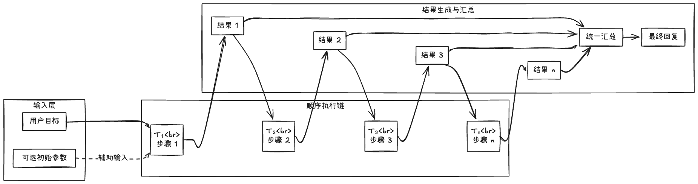

# 65. 分解策略一：线性分解

Day 64 说明了为什么需要任务分解、什么是好的分解。本节讨论**线性分解**：适用场景（强顺序依赖、前后步骤有明确输入输出关系）、**抽象结构**（步骤链、每步输入来自上一步输出），以及**风险**（某步失败导致后续全废、难以并行、步数膨胀）。

## 一、适用场景：强顺序依赖、前后步骤有明确输入输出关系

### 1. 强顺序依赖

- 前一步**必须**先于后一步完成，且后一步**依赖**前一步的结果。例如：“先查会议时间 → 再根据时间订机票 → 再根据航班订接机”。
- 若顺序颠倒（先订机票再查会议时间），可能订错日期或重复修改。

### 2. 明确输入输出关系

- 每一步的**输入**来自上一步的**输出**（或用户初始输入）；输出可作为下一步的输入或最终汇总的素材。
- 适合用**列表或管道**表示：`[step1, step2, step3]`，执行时按下标顺序，当前步可访问前面所有步的结果。

### 3. 典型场景

- 流程型任务：填报 → 校验 → 提交；查询 A → 根据 A 查 B → 汇总。
- 多步信息收集后总结：查天气 + 查订单 + 查时间 → 用三者的结果写一段总结。

## 二、抽象结构：步骤链、每步输入来自上一步输出

### 1. 步骤链

- **结构**：子任务序列 `[T1, T2, ..., Tn]`，执行顺序固定为 1 → 2 → … → n。
- **状态**：每执行完一步，将结果放入“已完成的输出列表”，下一步可读取该列表作为上下文或显式输入。

### 2. 数据流

- **输入**：用户目标 +（可选）初始参数。
- **第 i 步**：输入 = 用户目标 + 前 i-1 步的输出摘要或原始结果；输出 = 本步执行结果（文本或结构化数据）。
- **汇总**：所有步骤的输出作为“汇总步骤”的输入，生成最终回复。

### 3. 小结表

| 概念       | 含义                                         |
| ---------- | -------------------------------------------- |
| **步骤链** | 子任务有序列表，严格按序执行                 |
| **输入**   | 每步 = 目标 + 前序步输出                     |
| **输出**   | 每步结果追加到“已完成结果”，供后续与汇总使用 |

### 4. 线性分解流程示意图



- **数据流**：每步的输入 = 用户目标 + 前序步输出；每步输出追加到“已完成结果”，供下一步与汇总使用。
- **顺序**：T₁ → T₂ → … → Tₙ 不可颠倒；某步失败可能导致后续全废（见第三节风险）。

## 三、风险：某步失败导致后续全废、难以并行、步数膨胀

### 1. 某步失败导致后续全废

- 线性链中若第 k 步失败（如工具报错、超时），后续步骤往往**依赖**第 k 步的结果，无法跳过或替代，整体流程可能只能**失败终止**或**重试第 k 步**。
- **缓解**：对关键步加重试（Week 9 反思或简单重试）；或允许“跳过并标记未完成”，汇总时说明哪一步未完成。

### 2. 难以并行

- 因为强顺序依赖，前后步不能同时执行，**无法通过并行缩短总时长**；若某步很慢，整条链都变慢。

### 3. 步数膨胀

- 若分解过细，步骤数很多，每步都走 Agent 或工具调用，**延迟与 token 成本**会明显上升；且步数越多，中间某步失败的概率越大。

## 四、实战示例：线性分解在代码中的体现

在 **`week10/69_code/task_decomposition_agent_demo.py`** 中，分解阶段会得到子任务列表 `subtasks`，执行阶段**按顺序**遍历 `subtasks`，每步将当前子任务与“前序结果列表”交给执行器（如小 Agent 或工具调用），再把本步结果追加到列表，供下一步与汇总使用。对应结构如下：

```python
# 线性执行：按 subtasks 顺序，每步依赖前序结果
results = []
for i, sub in enumerate(subtasks):
    # 输入 = 用户目标 + 前序结果
    context = goal + "\n前序结果：\n" + "\n".join(results) if results else goal
    out = run_step(sub, context)  # 执行当前子任务
    results.append(out)
# 汇总
final = summarize(goal, results)
```

下一节（Day 66）将讲**分解策略二：树状分解**的优势与风险。
