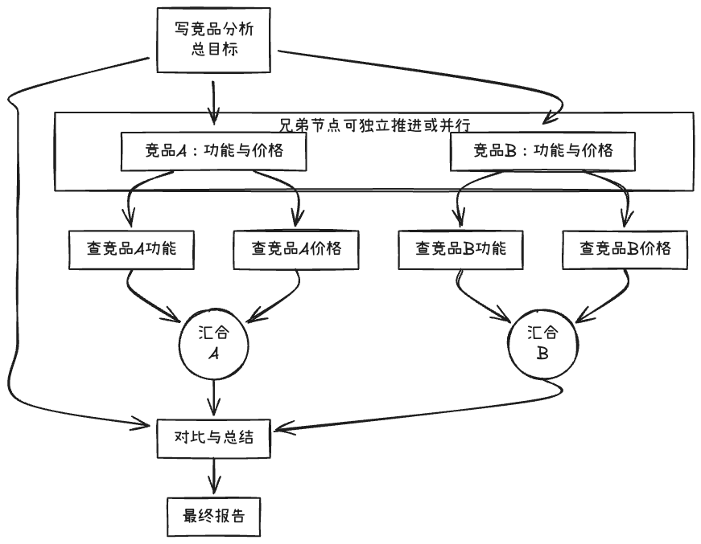

# 66. 分解策略二：树状分解

Day 65 讲了线性分解的适用场景与风险。本节讨论**树状分解**：按主题或维度拆成多棵子树、子任务可独立推进、便于回溯与剪枝的**优势**，以及分支过多导致步数爆炸、汇合与去重复杂、依赖关系易遗漏的**风险**。

## 一、优势：按主题或维度拆分、子任务可独立推进、便于回溯与剪枝

### 1. 按主题或维度拆分

- 把大目标拆成若干**并列维度**或**主题**，每个维度再往下拆。例如“写一份竞品分析”可拆成：竞品 A 分析、竞品 B 分析、对比与总结；每个竞品下再拆成：功能、价格、用户评价……
- **树状**：根 = 总目标，第一层 = 几个大方向，每层往下是更细的子点，形成树而不是一条线。

### 2. 子任务可独立推进

- 同一层兄弟节点（如“竞品 A”与“竞品 B”）之间若**无依赖**，可以**独立执行**；执行顺序可以是“先 A 再 B”或“先 B 再 A”，甚至后续可并行（Day 67）。
- 适合“分块收集信息、再汇总”类任务。

### 3. 便于回溯与剪枝

- **回溯**：某条分支失败或需要重做时，只需回到该分支的根，不必重做整棵树。
- **剪枝**：若某分支判定为不需要（如用户取消某竞品），可直接剪掉该分支及其子树，减少无效执行。

### 4. 小结

| 优势           | 含义                               |
| -------------- | ---------------------------------- |
| **按主题拆分** | 结构清晰，对应真实问题的维度       |
| **独立推进**   | 兄弟节点无依赖时可灵活顺序或并行   |
| **回溯与剪枝** | 局部失败可局部重试，不需要的可省略 |

### 5. 树状分解结构示意图



- **根**：总目标；**第一层**：按主题拆成的并列维度（竞品 A、竞品 B、对比与总结）。
- **叶子**：可执行单元（查功能、查价格）；同一父节点下的叶子执行完后在**父节点汇合**。
- **兄弟节点**（如竞品 A 与 竞品 B）无依赖，可独立推进或并行；**对比与总结**依赖前两棵子树汇合结果后再执行。

## 二、风险：分支过多导致步数爆炸、汇合与去重逻辑复杂、依赖关系易遗漏

### 1. 分支过多导致步数爆炸

- 若每一层都拆得很细、分支很多，**叶子节点**（实际执行单元）数量会急剧增加，总步数、token 与延迟都会很高。
- **缓解**：控制树的深度与每层宽度；或只展开“当前需要”的分支，其余按需懒加载。

### 2. 汇合与去重逻辑复杂

- 多棵子树都执行完后，需要在**父节点**做**汇合**：合并结果、去重、解决冲突（如同一信息被多个分支都查了一遍）。
- 若汇合规则不清晰，容易出现重复内容、遗漏分支结果或逻辑不一致。

### 3. 依赖关系易遗漏

- 树状分解时，若**隐含的跨分支依赖**没有显式标出（如“总结”依赖所有叶子结果），可能某分支尚未完成就开始汇总，或顺序错乱。
- **缓解**：显式标注“该节点依赖哪些子节点完成”；执行时按依赖顺序或 DAG 调度（见 Day 67）。

## 三、实战示例：树状结构的表示与执行顺序

树状分解在代码中通常用**嵌套结构**或**带父子关系的列表**表示，执行时可按**后序遍历**（先执行所有子节点，再在父节点汇合）或**层序**（先第一层，再第二层……）。下面用简化结构示意“竞品分析”的树与汇合：

```python
# 树状结构示例：竞品分析
tree = {
    "goal": "写竞品分析",
    "children": [
        {"goal": "竞品A：功能与价格", "children": [
            {"goal": "查竞品A功能", "children": []},
            {"goal": "查竞品A价格", "children": []},
        ]},
        {"goal": "竞品B：功能与价格", "children": [...]},
        {"goal": "对比与总结", "children": []},  # 依赖前两个子节点结果
    ],
}

# 执行：先执行叶子，再在父节点汇合；"对比与总结"需等前两个子节点完成
def run_tree(node, parent_results=None):
    if not node["children"]:
        return run_step(node["goal"], parent_results)
    child_results = [run_tree(c, parent_results) for c in node["children"]]
    return merge(node["goal"], child_results)
```

实际项目中可结合 Day 67 的 DAG 与汇合节点，明确“对比与总结”依赖前两个子节点完成后再执行。

下一节（Day 67）将讲**分解策略三：并行与汇合**的适用场景、抽象结构与风险。
