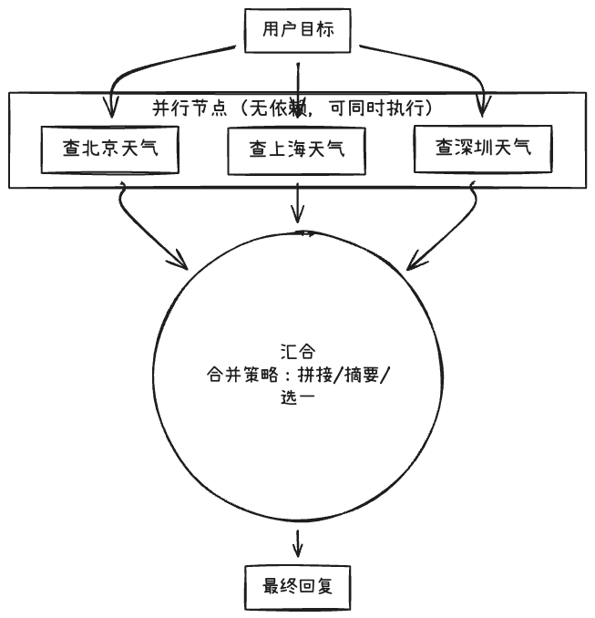

# 67. 分解策略三：并行与汇合

Day 66 讲了树状分解的优势与风险。本节讨论**并行与汇合**：**适用场景**（子任务彼此独立或可并行执行、最后需汇总结果）、**抽象结构**（DAG、并行节点与汇合节点、结果合并策略），以及**风险**（并行度与资源/限流冲突、汇合时冲突或重复、部分失败时的降级策略）。

## 一、适用场景：子任务彼此独立或可并行执行、最后需汇总结果

### 1. 子任务彼此独立

- 多个子任务之间**无数据依赖**或只有**对同一输入的读**，可同时执行。例如：同时查“北京天气”“上海天气”“深圳天气”；或同时查“订单状态”“库存”“用户信息”。
- 适合**信息收集**阶段：多源、多维度并行拉取，再在后续步骤中汇总或决策。

### 2. 最后需汇总结果

- 并行执行完成后，通常需要**一个汇合步骤**：把各分支结果合并成一份回复、一张表或一个决策。例如：三个城市天气 → “三地天气汇总”；多源信息 → “综合报告”。

### 3. 典型场景

- 多源查询后综合：并行调用多个 API 或工具，再汇总。
- 多候选评估：并行生成或评估多个方案，再选优或合并。

## 二、抽象结构：DAG、并行节点与汇合节点、结果合并策略

### 1. DAG（有向无环图）

- **节点**：表示子任务或“汇合”动作。
- **边**：表示依赖；A → B 表示 B 依赖 A 完成。无环保证执行顺序可确定。
- **并行**：若多个节点之间两两无路径依赖，则可并行执行；若有共同后继（汇合点），则需等这些节点都完成后再执行汇合节点。

### 2. 并行节点与汇合节点

- **并行节点**：一组无依赖关系的叶子（或子图），可同时执行；在实现上多为“并发调用多个执行器”。
- **汇合节点**：输入为多条边（多个前驱的结果），输出为合并后的结果；合并策略可以是拼接、选一、投票、或再调一次 LLM 做综合。

### 3. 结果合并策略

- **拼接**：把各分支结果按固定顺序拼成一段文本或列表，简单但可能冗长。
- **摘要/综合**：把各分支结果交给 LLM，生成一段总结或结构化输出，更紧凑、可读性好。
- **选一/投票**：多分支产生多个候选时，按规则或模型选一个；或多数表决。

### 4. 小结表

| 概念         | 含义                                |
| ------------ | ----------------------------------- |
| **DAG**      | 有向无环图，节点=任务/汇合，边=依赖 |
| **并行节点** | 无依赖的一组任务可同时执行          |
| **汇合节点** | 多个前驱结果合并为一个结果          |
| **合并策略** | 拼接、摘要/综合、选一/投票等        |

### 5. 并行与汇合流程示意图



- **DAG**：边表示依赖（G → P₁/P₂/P₃ 表示子任务依赖目标；P₁/P₂/P₃ → 汇合 表示汇合依赖三路完成），无环。
- **并行节点**：P₁、P₂、P₃ 之间无边，可同时执行；完成后统一进入**汇合节点**。
- **汇合节点**：多前驱结果按合并策略（拼接、摘要/综合、选一/投票）得到单一输出，再生成最终回复。

## 三、风险：并行度与资源/限流冲突、汇合时冲突或重复、部分失败时的降级策略

### 1. 并行度与资源/限流冲突

- 同时发起过多请求（如大量 API、LLM 调用）可能触发**限流**、**连接数上限**或**成本瞬时过高**。
- **缓解**：限制最大并行度（如最多 3 路并行）、排队或背压；对外部 API 遵守其并发限制。

### 2. 汇合时冲突或重复

- 多分支可能返回**重叠信息**（如都查了同一订单），汇合时需**去重**或**冲突解决**（以谁为准）。
- **缓解**：汇合前做简单去重或按 key 合并；或明确“以某分支为准、其余补充”。

### 3. 部分失败时的降级策略

- 若并行多路中**部分失败**（如三个天气只拿到两个），汇合时需决定：是**失败即整体失败**，还是**用已有结果做部分汇总**并标明“某路未获取”。
- **缓解**：定义“最少需要几条结果才汇合”；或允许部分结果 + 在汇总中说明缺失项。

## 四、实战示例：并行执行与汇合在代码中的思路

在 **`week10/69_code/task_decomposition_agent_demo.py`** 中，当前版本采用**线性分解与顺序执行**；若要支持并行，可把“无依赖的一组子任务”一次性提交执行，再汇合。下面用伪代码示意并行与汇合的逻辑：

```python
# 假设 subtasks 中部分可并行（如前两步无依赖）
from concurrent.futures import ThreadPoolExecutor, as_completed

def run_parallel_then_merge(subtasks, max_workers=3):
    # 简化：前 n 个视为可并行，最后一个为汇合
    parallel_group = subtasks[:-1]
    merge_task = subtasks[-1]
    with ThreadPoolExecutor(max_workers=max_workers) as ex:
        futures = {ex.submit(run_step, t, goal): t for t in parallel_group}
        results = []
        for f in as_completed(futures):
            try:
                results.append(f.result())
            except Exception as e:
                results.append(f"该步失败: {e}")
    # 汇合
    return run_step(merge_task, goal + "\n各步结果：\n" + "\n".join(results))
```

实际项目中还可结合 DAG 库（如 `networkx`）显式建图，按拓扑序识别“可并行的批次”与“汇合点”。

下一节（Day 68）将讲**任务分解的失败模式与修复**。
