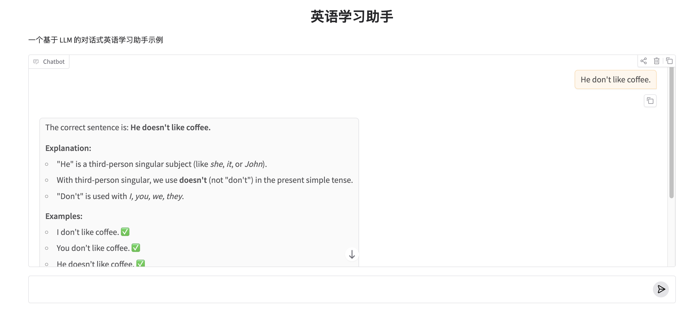

# 09.前端交互
在前面的内容中，我们已经学会了如何通过 LangChain 组织一次 LLM 调用，并用 PromptTemplate 和 LCEL 构建清晰的生成流程。但如果只能在命令行里运行，这还算不上一个真正“可用”的应用。

**Gradio 的作用，就是把你的 LLM 能力，快速变成一个可以“点开就用”的聊天界面。**


## 1. 为什么选择 Gradio？

在没有 Gradio 之前，展示 AI 项目需要写复杂的 HTML/CSS 和后端 API。

- **极简代码：** 几行 Python 就能生成输入框、滑块和聊天窗口。
- **即时分享：** 运行代码后会生成一个临时公网链接，你可以发给朋友直接在手机上测试你的模型。
- **组件丰富：** 自带文本框、图像上传、音频处理和实时聊天界面（ChatInterface）。


## 2. Gradio 的核心架构

Gradio 的逻辑非常直观：它就像一个“包装盒”，你把写好的 Python 函数丢进去，它负责把函数的输入变成 UI 组件，把输出显示在网页上。
它提供了两种主要的构建方式：

1. **Interface (快速模式)**：预定义了输入、输出和处理函数。适合快速展示模型原型。
2. **Blocks (自定义模式)**：提供了更灵活的布局控制。你可以像搭积木一样排列按钮、文本框和图表，适合构建复杂的 Agent 仪表盘。

## 3. 常用控件介绍

### 1. 快速对话接口控件 (`gr.ChatInterface`)

这是快速模式的核心控件，“傻瓜式”的一键生成，适合 90% 的标准聊天机器人 需求。
在Blocks构建界面时，你需要自己处理文本框、清除按钮、撤销按钮以及历史记录的维护。而 `gr.ChatInterface()` 会自动为你生成：

* **美观的对话窗口**：自动适配桌面和移动端。
* **完整的控制流**：自带“提交 (Submit)”、“清除 (Clear)”、“撤销 (Undo)”和“重试 (Retry)”按钮。
* **多轮对话支持**：自动将历史记录传递给你的处理函数。


使用 `gr.ChatInterface` 的核心只需要一个函数，该函数必须接收两个参数：`message`（当前输入）和 `history`（对话历史）。

```python
import gradio as gr

# 定义后端逻辑
def predict(message, history):
    # history 是一个列表，格式为 [['用户1', '助手1'], ['用户2', '助手2']]
    if "你好" in message:
        return "你好！我是你的英语学习助手。"
    else:
        return f"你刚才说的是：'{message}'，我们来深入讨论一下。"

# 启动界面
gr.ChatInterface(predict).launch()

```


**常用配置参数**

`gr.ChatInterface` 提供了丰富的参数来自定义你的Agent：

| 参数 | 说明 | 示例 |
| --- | --- | --- |
| **`fn`** | 处理函数 | `fn=predict` |
| **`title`** | 界面顶部大标题 | `title="AI 英语私教"` |
| **`description`** | 标题下方的详细描述 | `description="练习口语与语法纠错"` |
| **`examples`** | 预设的快捷提问列表 | `examples=["帮我润色这段话", "解释虚拟语气"]` |
| **`theme`** | 界面主题 | `theme="soft"` 或 `theme="monochrome"` |
| **`type`** | 消息格式类型 | `type="messages"` (推荐，适配最新 OpenAI 风格) |
| **`multimodal`** | 是否开启多模态（传图） | `multimodal=True` |


### 2. 聊天机器人控件 (`gr.Chatbot`)

这是对话的核心控件，用于展示对话流。

* **功能**：支持显示文本、Markdown、图片甚至视频，并能通过 `metadata` 显示思考过程。
* **代码示例**：
```python
# 消息列表格式
chatbot = gr.Chatbot(type="messages", label="对话记录", show_copy_button=True)

```


### 3. 多模态输入框 (`gr.MultimodalTextbox`)

允许用户在同一个输入窗口中发送文字、上传图片或文件。

* **功能**：非常适合“拍照搜题”或“看图说话”的英语学习场景。
* **代码示例**：
```python
input_box = gr.MultimodalTextbox(interactive=True, file_types=["image"], placeholder="输入文字或上传图片...")

```


### 4. 音频控件 (`gr.Audio`)

处理语音输入和播报。

* **功能**：支持麦克风实时录音（用于练习发音）和自动播放 Agent 的语音回复。
* **代码示例**：
```python
audio_input = gr.Audio(sources=["microphone"], type="filepath", label="口语练习")

```

### 5. 状态保持器 (`gr.State`)

一个隐藏的“变量容器”。

* **功能**：在前端存储用户的对话历史（History）或学习进度。它不会显示在 UI 上，但会在函数调用间传递。

本章节将基于快速模式进行开发，跑通逻辑进行体验，后面会切换到Block自定义模式。

## 3. 交互界面开发

#### 第一步：安装

```bash
pip install gradio
```

#### 第二步：创建一个简单的聊天界面

基于`gr.ChatInterface`快速创建一个聊天界面。

```python
import gradio as gr


def get_ai_response(user_message: str, chat_history: list) -> str:
    """
    调用大模型，生成回复内容
    - user_message: 当前用户输入
    - chat_history: 过往对话历史（可用于上下文）
    """
    # TODO: 在这里接入 LangChain 
    return f"AI 正在思考有关「{user_message}」的答案..."


def chat_handler(message: str, history: list) -> str:
    """
    Gradio ChatInterface 的回调函数
    负责：
    1. 接收用户输入
    2. 调用 LLM 生成回复
    3. 返回给前端展示
    """
    return get_ai_response(message, history)


# 使用 Gradio 专门为聊天机器人设计的高层接口
chat_ui = gr.ChatInterface(
    fn=chat_handler,
    title="英语学习助手",
    description="一个基于 LLM 的对话式英语学习助手示例"
)


if __name__ == "__main__":
    chat_ui.launch(share=True)  # share=True 会生成公网访问链接

```

#### 第三步：接入AI

然后结合上一节的 LangChain 调用，就可以快速实现一个最简单的对话式英语学习助手。

```Python

def get_ai_response(user_message: str, chat_history: list) -> str:
    """
    调用大模型，生成回复内容
    - user_message: 当前用户输入
    - chat_history: 过往对话历史（可用于上下文）
    """

    english_tutor_prompt = ChatPromptTemplate.from_messages([
        (
            "system",
            """
            You are an English Learning Assistant.

            Your primary role is to help learners improve their English through:
            - clear explanations
            - gentle corrections
            - practical examples
            - guided practice

            Follow these principles at all times:
            1. Be encouraging and patient. Never criticize the learner.
            2. Correct mistakes politely and explain why they are wrong.
            3. Use simple, clear language unless the learner asks for advanced explanations.
            4. Always prefer examples over abstract rules.
            5. Adapt your response to the learner’s English level when possible.

            When responding:
            - If the learner makes a mistake, first show the corrected version.
            - Then explain the correction briefly.
            - Then provide 1–2 example sentences.
            - If appropriate, ask a short follow-up question to encourage practice.
            """.strip()
        ),
        ("human", "{user_message}")
    ])

    model = ChatOpenAI(model="qwen-flash", base_url="https://dashscope.aliyuncs.com/compatible-mode/v1")
    output_parser = StrOutputParser()

    # 使用 LCEL 表达式将 prompt、model、parser 串联起来
    chain = english_tutor_prompt | model | output_parser

    result = chain.invoke({"user_message": user_message})
    return result
```

完成后用Python运行该程序即可通过页面进行交互，效果如下：



