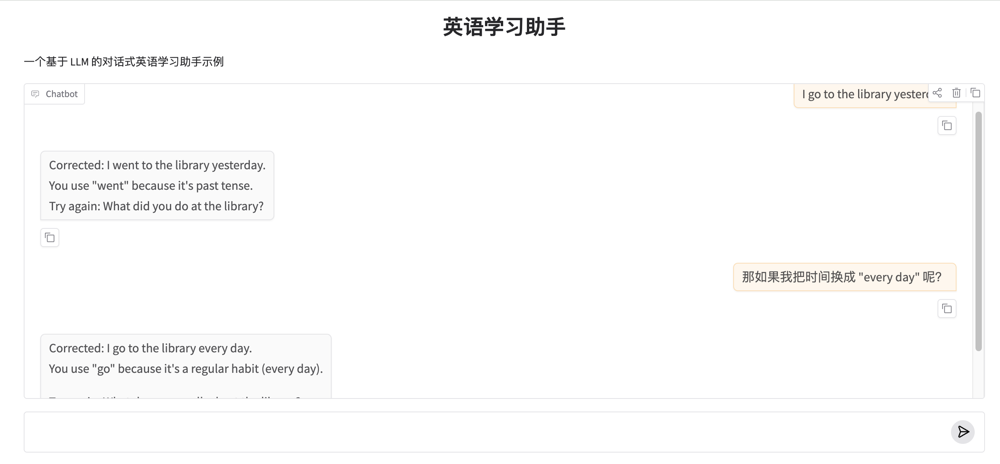

# 10.多轮对话

前面已经可以通过界面与Agent进行交互，但到目前为止，还有一个明显的问题：模型每次都像“第一次见你”，并不会真正“辅导”。
这一章的目标，就是解决这个问题。

## 一、什么是“多轮对话 Agent”？

当前是单轮调用，逻辑如下：

```text
用户：请帮我改这句话
模型：给出修改
（结束）
```

问题是：

* 模型不知道你之前学了什么
* 不知道你是初学者还是进阶者
* 每一轮都要重新解释规则


多轮对话是将历史对话加进来，让模型“看到”历史对话**这个上下文，调整后的逻辑如下：

```text
用户：我写了一句话
模型：修改 + 解释

用户：那我这样写可以吗？
模型：基于【上一轮内容】继续反馈

用户：我想更正式一点
模型：在已有上下文基础上调整
```

为什么要这么做呢？

 **LLM 本身没有记忆**，所谓“记住”，只是你**每次都把历史对话重新发给它**。

## 二、流程调整

整个调用流程如下：

```
[ User Input ]
      ↓
[ Gradio UI ]
      ↓
[ 对话状态（history） ]
      ↓
[ Prompt 组装 ]
      ↓
[ LangChain 调用 LLM ]
      ↓
[ 模型输出 ]
      ↓
[ 更新 UI + 状态 ]
```

注：这里**不引入复杂上下文能力**，只做**“可连续对话”的最小系统**，更完整的上下文知识后面有独立的一周进行学习。


## 三、代码实现

### 1. 相关组件
在 LangChain 中，我们不需要手动拼接字符串，而是使用专门的组件`MessagesPlaceholder`来管理对话上下文。
这个组件在 Prompt 模板中预留一个位置，专门用来存放不断增长的对话记录。

```python
from langchain_core.prompts import ChatPromptTemplate, MessagesPlaceholder

english_tutor_prompt = ChatPromptTemplate.from_messages([
    ("system", """You are an English writing tutor.
You help learners improve step by step.
Correct gently, explain briefly, and encourage revision."""),
    MessagesPlaceholder(variable_name="chat_history"), # 记忆存放处
    ("user", "{user_message}"),
])

```

### 2.模拟存储

在实际应用中，我们会用数据库存储记忆。这里，我们先用 Python 字典在内存中模拟。

```python
from langchain_community.chat_message_histories import ChatMessageHistory
from langchain_core.runnables.history import RunnableWithMessageHistory

# 存储不同用户的记忆
store = {}

def get_session_history(session_id: str):
    if session_id not in store:
        store[session_id] = ChatMessageHistory()
    return store[session_id]

# 创建带记忆的最终链
chain_with_history = RunnableWithMessageHistory(
    chain,
    get_session_history,
    input_messages_key="user_message",
    history_messages_key="chat_history",
)
```

### 3. 接入 Gradio 界面

Gradio 的 `ChatInterface` 已经为我们处理了 UI 上的历史显示，我们只需要把这些历史同步给 LangChain 即可。

```python

def get_ai_response(user_message: str, chat_history: list) -> str:
    """
    调用大模型，生成回复内容
    - user_message: 当前用户输入
    - chat_history: 过往对话历史（可用于上下文）
    """

    
    model = ChatOpenAI(model="qwen-flash", base_url="https://dashscope.aliyuncs.com/compatible-mode/v1")
    output_parser = StrOutputParser()

    # 使用 LCEL 表达式将 prompt、model、parser 串联起来
    chain = english_tutor_prompt | model | output_parser

    response = chain_with_history.invoke(
        {"user_message": user_message},
        config={"configurable": {"session_id": "user_001"}}
    )
    return response


demo = gr.ChatInterface(
    fn=tutor_chat,
    title="✍️ 英语写作连续辅导 Agent",
    description="你可以先发一段作文，我会给建议；你修改后再发给我，我会检查你的进步！",
    type="messages" # 使用最新的消息格式
)

if __name__ == "__main__":
    demo.launch()

```

以上多轮对话的功能就完成了，效果如下：



值得注意的是，但随着对话越来越长，Token 的消耗会剧增，甚至超过模型的处理上限（Context Window）。在实际开发中，有几种常见的记忆策略：

1. **全量记忆 (Window Buffer)**：保留所有对话（最消耗 Token）。
2. **滑动窗口 (Window Memory)**：只记得最近 5-10 轮对话。
3. **摘要记忆 (Summary Memory)**：让 LLM 定期把之前的对话总结成一段话，节省空间。

有兴趣的可以自己进一步优化上面的流程。