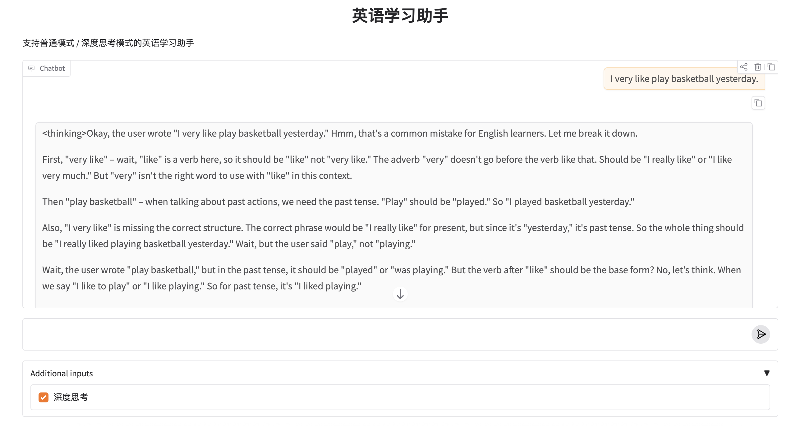

# 13.深度思考

在前面的例子中，LLM在做一件事就是根据上下文，**直接预测**下一个 Token。这非常快，也非常省成本，但在复杂场景中容易失效。比如输入的句子结构混乱、多处语法错误叠加、逻辑顺序不清等。这些情况需要“先判断问题类型，再给建议”。

这时就需要**深度思考**。


## 一、什么是深度思考

简单来说，**深度思考**是指模型在给出最终答案前，执行更长、更完整的推理轨迹。它通常表现为更长的中间推导、更多自我校验、更慢的生成速度、更高的 token 消耗、更高的正确率（特别是在复杂任务上）。

深度思考是推理模型特有的能力。如果说一般的模式代表了**快思考**，那么像**DeepSeek-R1**、**OpenAI o1**等模型代表了**慢思考**。这些模型的特点是会在内部执行多步推理、经常生成隐藏或半隐藏的推理轨迹、使用强化学习训练“先想再答”。

同样的问题同这些模型会先分析已知条件，然后写出计算步骤，最后再给最终结论。


## 二、深度思考从哪里来？

深度思考来自于训练过程，它基于强化学习（RL）在训练过程中被引导去走更完整的推理路径。

在普通模型的训练中，只关心模型回答得对不对。但在推理型模型（如 DeepSeek-R1, o1）的训练中，评价标准发生了质变。

模型在回答复杂问题时，会被这样引导：

- 高分奖励： 推理逻辑严密、每一步都有据可依、最终结论正确。
- 低分惩罚： 跳过中间步骤直接“蒙”答案、逻辑断层、或是过程胡编乱造。

以一道典型的推理题为例：

> **问题：**
> 一个商品原价 100 元，先打 8 折，再打 9 折，最终价格是多少？

在训练数据中，可能会同时出现多种回答示例。


#### 示例一：只有结论，没有推理

```
最终价格是 72 元。
```

这种回答在“结果正确”的前提下，**并不会直接被判为高质量样本**。
原因很简单：模型没有暴露任何推理过程，训练系统无法判断它是：

* 真正理解了折扣计算
* 还是“碰巧猜对”了答案

因此，这类样本在强化学习阶段往往只能得到**较低的奖励分**。

#### 示例二：推理过程完整，结论正确（高质量样本）

```
原价是 100 元。
打 8 折后价格为 100 × 0.8 = 80 元。
再打 9 折后价格为 80 × 0.9 = 72 元。
所以最终价格是 72 元。
```

这种回答具备几个关键特征：

* 中间步骤清晰、可验证
* 推理顺序符合人类的常识计算过程
* 最终结论与推理结果一致

在训练中，这类回答会被明确标记为**“高质量推理”**，从而获得更高的正向反馈。

#### 示例三：跳步推理，结论正确（低质量样本）

```
100 × 0.8 × 0.9 = 72，所以答案是 72 元。
```

虽然数学上是正确的，但在很多推理型训练设置中，这种回答**仍然可能被压低评分**，原因在于：

* 中间逻辑被高度压缩
* 缺乏对问题条件的逐步展开
* 对复杂问题而言，这种风格更容易导致错误迁移

因此，它在训练中往往处于“介于可接受与高质量之间”的位置。

随着训练样本不断累积，模型会在统计意义上“学会”在复杂问题上，把推理过程展开，比直接给答案，更容易稳定地拿到高分。然后模型就会更频繁地生成这种结构。
而在使用者看下来表现为回答变长了，推理步骤变多了，结论前的铺垫更加充分。


## 三、让Agent支持深度思考

接下来，在前面例子（Day11版本）的基础上，加入一个**是否启用深度思考）」开关**。

1. 根据开关选择不同模型，代码如下：

```python
def get_model(is_reasoning):
    if is_reasoning:
        print("Using deep thinking...")
        return ChatOpenAI(model="qwen-flash", 
                          base_url="https://dashscope.aliyuncs.com/compatible-mode/v1",
                          extra_body={"enable_thinking": True})
    else:
        return ChatOpenAI(model="qwen-max", base_url="https://dashscope.aliyuncs.com/compatible-mode/v1")
```
注意，不同的模型深度思考的传参可能不一样，这里阿里云百炼模型需要在extra_body中传入enable_thinking为True进行开启。

2. 给langchain_openai打猴子补丁

当前langchain_openai的版本(1.1.6)会把推理过程的文本丢掉，这里采取猴子补丁的方式让推理文本能够传递过来，代码如下：
```python
from typing import Mapping, Any
from langchain_core.messages import AIMessageChunk, BaseMessageChunk
from langchain_openai.chat_models import base
from typing import cast

# 保存原始方法
_original_create_chunk = base._convert_delta_to_message_chunk


def _patched_convert_delta_to_message_chunk(
    _dict: Mapping[str, Any], default_class: type[BaseMessageChunk]
) -> BaseMessageChunk:
    """
    Monkey patch:
    - 保留 OpenAI / Qwen 扩展字段（reasoning_content 等）
    """
    message_chunk = _original_create_chunk(_dict, default_class)

    try:
        # print(f"patch reasoning_content: {_dict}, {default_class}")
        role = cast(str, _dict.get("role"))
        additional_kwargs: dict = {}
        if _dict.get("reasoning_content"):
            additional_kwargs["reasoning_content"] = _dict["reasoning_content"]
        if role == "assistant" or default_class == AIMessageChunk:
            message_chunk.additional_kwargs = additional_kwargs
    except Exception:
        # 兜底，绝不能影响主流程
        pass

    return message_chunk


# 打猴子补丁
base._convert_delta_to_message_chunk = _patched_convert_delta_to_message_chunk
```

3. 更新Chain：不要用 StrOutputParser

```python
chain = english_tutor_prompt_deep | model

chain_with_history = RunnableWithMessageHistory(
    chain,
    get_session_history,
    input_messages_key="user_message",
    history_messages_key="chat_history",
)
```
StrOutputParser会把模型输出最终结果外的其他信息丢掉。

4. 在流式中分别处理thinking和content部分

```python
from langchain_core.messages import AIMessageChunk

def stream_ai_response(user_message: str, session_id: str):
    answer_buffer = ""
    thinking_buffer = ""

    for chunk in chain_with_history.stream(
        {"user_message": user_message},
        config={"configurable": {"session_id": session_id}}
    ):
        if not isinstance(chunk, AIMessageChunk):
            continue

        # ===== 1. 深度思考（不进历史）=====
        if "thinking" in chunk.additional_kwargs:
            thinking_buffer += chunk.additional_kwargs["thinking"]

            # 只用于前端展示
            yield (
                f"<thinking>{thinking_buffer}</thinking>\n\n"
                f"{answer_buffer}"
            )

        # ===== 2. 最终回答（进历史）=====
        if chunk.content:
            answer_buffer += chunk.content

            yield (
                f"<thinking>{thinking_buffer}</thinking>\n\n"
                f"{answer_buffer}"
            )
```

这里的关键点是思考部分不需要进入对话历史，所以`thinking_buffer` **永远不拼进 `answer_buffer`**，LangChain 只会把 `answer_buffer` 写进 `AIMessage.content`，thinking 天然被排除在记忆系统之外。

5. 在UI加入开关，代码如下：

```python
chat_ui = gr.ChatInterface(
    fn=chat_handler,
    additional_inputs=[
        gr.Checkbox(label="深度思考", value=False)
    ],
    title="英语学习助手",
    description="支持普通模式 / 深度思考模式的英语学习助手"
)

if __name__ == "__main__":
    chat_ui.launch(share=True)
```

至此，英语学习Agent就可以通过开关控制是否开启深度思考了。效果如下：



完整代码参考`13_code`文件夹。