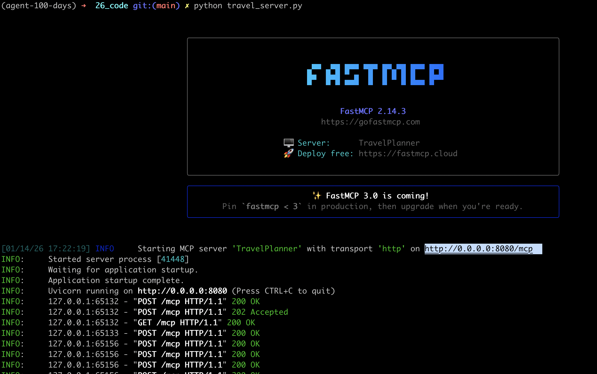
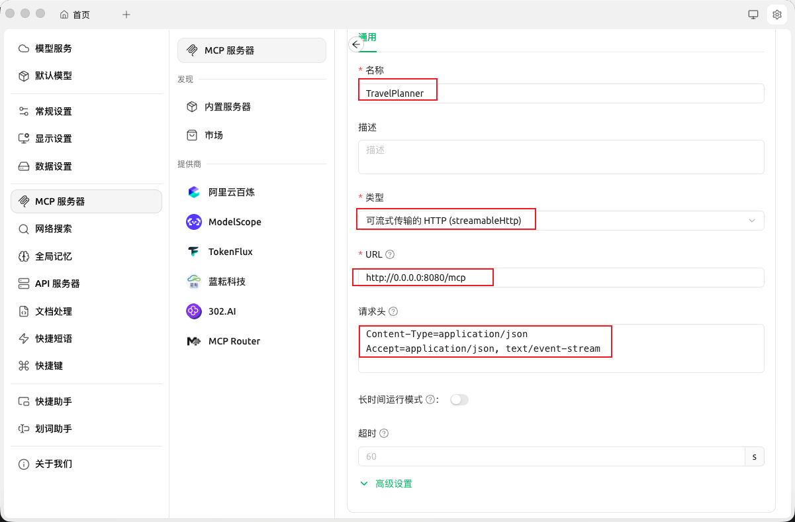
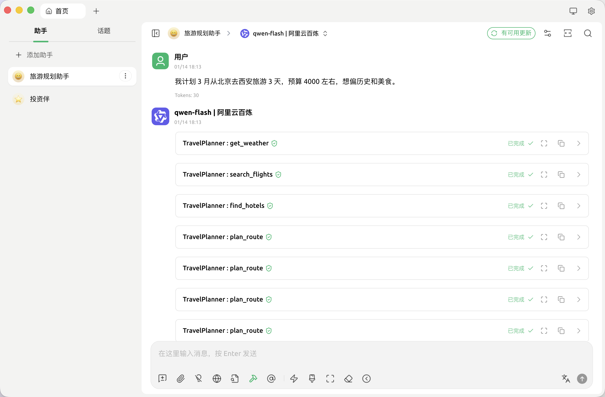
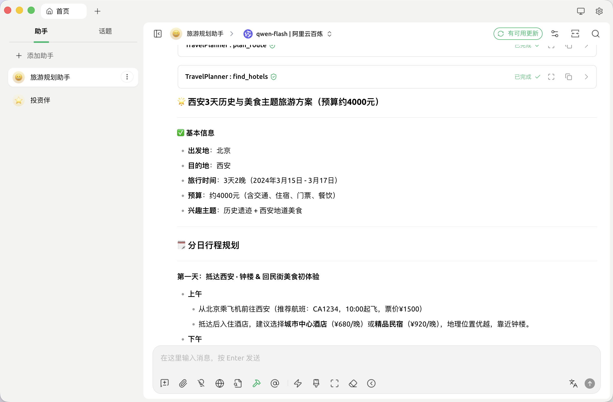

# 26. MCP实战

本节将构建一个可被大模型调用的旅游信息与规划服务，最终的效果是一个Agent可以通MCP调用服务，完成旅游规划相关任务。

### 一、项目架构

本项目实现一个 **TravelPlanner MCP Server**，对外提供两类能力：

**工具（Tools）**

* 查询航班
* 查询酒店
* 查询天气
* 规划路线

**资源（Resources）**

* 城市热门景点
* 城市指南

**整体架构**

```
Agent
    │
    ▼
MCP 协议
    │
    ▼
TravelPlanner MCP Server
    ├── Tools: 航班 / 酒店 / 天气 / 路线
    └── Resources: 景点列表 / 城市指南
```

## 二、环境准备

安装 FastMCP：

```bash
pip install mcp
```

下载安装Cherry Studio, 用于连接和使用MCP服务。下载地址：

[https://www.cherry-ai.com/](https://www.cherry-ai.com/)

### 三、定义 MCP Tools（旅游能力）

1. 查询航班

```python
@mcp.tool()
async def search_flights(origin: str, destination: str, date: str, cabin_class: str = "Economy"):
    """
    查询航班信息。
    """
    return {
        "flights": [
            {"flight_no": "CA1234", "price": "¥1500", "departure": "10:00"},
            {"flight_no": "MU5678", "price": "¥1850", "departure": "14:30"}
        ],
        "status": "success"
    }
```

这里用了模拟数据，在真实项目中，这里可以对接携程 / 飞猪等 API。

2. 查询酒店

```python
@mcp.tool()
async def find_hotels(city: str, checkin_date: str, budget_range: str):
    return [
        {"name": "城市中心酒店", "rating": 4.5, "price": "¥680"},
        {"name": "精品民宿", "rating": 4.8, "price": "¥920"}
    ]
```

3. 查询天气

```python
@mcp.tool()
async def get_weather(city: str, date: str):
    return {"city": city, "date": date, "forecast": "晴朗", "temp": "15°C - 22°C"}
```

4. 规划路线

```python
@mcp.tool()
async def plan_route(start: str, end: str, mode: str = "transit"):
    return f"从 {start} 到 {end} 的 {mode} 方案：预计耗时 30 分钟，距离 5 公里。"
```

### 四、定义 MCP Resources

Resource 适合不是算出来的，是**长期存在的内容**。

1. 城市热门景点 Resource

```python
@mcp.resource("attractions://{city}")
def get_attractions(city: str) -> str:
    data = {
        "西安": "1. 秦始皇陵兵马俑\n2. 大雁塔\n3. 西安城墙",
        "巴黎": "1. 埃菲尔铁塔\n2. 卢浮宫\n3. 凯旋门"
    }
    return data.get(city, "暂无景点数据。")
```

这相当于你给模型开放了一个“旅游知识 URI”：

```
attractions://西安
attractions://巴黎
```

模型可以像查文档一样读取它。

2. 城市指南 Resource

```python
@mcp.resource("guides://{city}")
def get_city_guide(city: str) -> str:
    """
    获取城市的背景文化介绍。
    """
    guides = {
        ...
    }
    return guides.get(city, f"抱歉，目前还没有关于 {city} 的详细文化指南，建议查阅维基百科。")
```

这类指南在实际开发过程中可以对接维基百科、数据库、CMS内容等。

### 五、启动 MCP Server

```python
if __name__ == "__main__":
    mcp.run(transport="http", host="0.0.0.0", port=8080)
```

运行`python travel_server.py`后可以看到了类型以下截图：



启动后，这个服务就成为一个标准 MCP 旅游规划能力提供方。

可以被Claude Desktop、Cursor、Cherry Studio等调用，这里以Cherry Studio为例。

### 六、接入MCP

打开Cherry Studio，添加MCP服务。

1. 点击 **设置 → MCP → 添加**
2. 填写MCP信息：
- 名称：`TravelPlanner`（可自定义）
- 类型：**可流式传输的 HTTP**
- URL：`http://127.0.0.1:8080/mcp`
- 请求头：

```
Content-Type=application/json
Accept=application/json, text/event-stream
```



3. 创建对话助手
   
   a. 返回首页 → 左侧点击 **添加助手**
   
   b. 选择 **默认助手**
   
   c.添加后，右键助手 → **编辑助手**
   
   d. 设置助手提示词，示例如下：
   
   ```markdown
   你是一个旅游规划智能体，可以通过 MCP 访问外部能力与资源来完成任务。
   
   你不需要关心具体有哪些工具实现，但你可以通过 MCP 获取以下“能力类型”：
   
   - 出行与交通查询能力（如航班、高铁、公共交通）
   - 住宿与价格查询能力（如酒店、民宿）
   - 天气与环境信息能力
   - 城市信息与景点推荐能力
   - 路线与出行方案规划能力
   - 旅游知识与城市指南资源
   
   ----------------------------
   工作目标
   ----------------------------
   将用户的自然语言需求，转化为可执行的旅游方案与建议。
   
   ----------------------------
   标准工作流程
   ----------------------------
   
   当用户提出旅游请求时，你应遵循以下流程：
   
   1. 明确用户约束  
      - 出发地 / 目的地  
      - 时间 / 天数  
      - 预算  
      - 兴趣主题  
   
   2. 获取背景信息  
      - 通过 MCP 读取城市相关的指南类资源  
      - 获取该城市的景点候选信息  
   
   3. 获取动态信息  
      - 查询出行方式与交通价格  
      - 查询住宿选项  
      - 查询目的地天气情况  
   
   4. 形成规划草案  
      - 给出分天行程结构  
      - 给出交通与住宿建议  
   
   5. 细化执行信息  
      - 在需要时获取路线与出行方式  
      - 补充天气提醒、文化注意事项  
   
   6. 输出结果  
      - 生成结构清晰、可执行的旅游方案  
      - 明确包含：行程、住宿、交通、天气提示
   
   ----------------------------
   行为规范
   ----------------------------
   
   - 当需要外部事实信息时，必须通过 MCP 获取，而不是自行编造。
   - 稳定信息（如城市背景、景点介绍）优先从 MCP 资源中读取。
   - 动态信息（如价格、天气、交通）应通过 MCP 能力查询。
   - 如果信息不足，应主动补充查询后再规划。
   - 输出结果应服务于“可执行旅行决策”，而不仅是介绍。
   
   你的核心职责不是聊天，而是“调度 MCP 能力完成规划”。
   
   ```
   
4. 对话测试
选择刚创建的助手即可开始对话，选择模型，比如qwen-plus，在对话框下面选择上面创建的MCP服务器（TravelPlanner）即可进行对话。效果如下：


