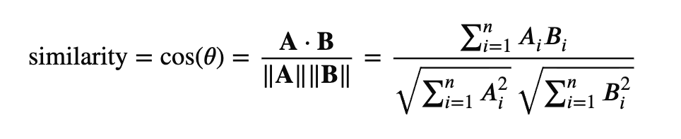

# 29.RAG 是怎么工作的

RAG（Retrieval-Augmented Generation，检索增强生成）是让大模型“站在你的知识库上回答”的核心技术。在 Week1 的「Token、Embedding 与向量空间」中，我们已经知道：文本要先变成 Token、再通过 Embedding 映射到高维向量空间，语义相近的内容在空间里会彼此靠近。RAG 正是利用这一原理——把「用户问题」和「文档块」都编码成向量，用相似度检索出最相关的片段，再交给 LLM 生成答案。本节将拆解 RAG 的完整链路、向量化在其中的作用，以及它与微调的对比，帮你把前后知识串起来。

## 一、RAG 核心链路拆解

RAG 的本质是：**先根据用户问题从外部知识中检索相关片段，再把检索结果和问题一起喂给 LLM，让模型在“有据可查”的前提下生成答案。** 整条链路可以概括为三个阶段：**Indexing（索引）→ Retrieval（检索）→ Generation（生成）**。

先想象一个人回答问题的过程。

有人问你：

> “公司 2026 年的报销制度是怎样的？”

你会怎么做？

你**不会**凭记忆瞎答，你会：

1. 打开公司知识库 / 文档
2. 搜索“报销制度”，找到相关段落
3. 看一眼，再用自己的话回答

这整个过程，就是 **RAG**。

下面详细说明下这三个阶段。

### 1. Indexing

把知识“装进可检索的仓库”。

在用户提问之前，需要先把你的文档、手册、内部知识等**非结构化文本**整理成模型和检索系统能用的形式：

| 步骤                 | 说明                                                                                                                                                              |
| ------------------ | --------------------------------------------------------------------------------------------------------------------------------------------------------------- |
| **加载与解析**          | 从 PDF、网页、数据库等来源读取原始内容，解析成纯文本（必要时保留元数据如页码、标题）。                                                                                                                   |
| **分块（Chunking）**   | 将长文档切成合适长度的小块（如 512 token 一块），既保证语义完整，又便于后续检索和放入上下文。这里的 **token** 就是 Week1 里说的、模型处理文本的基本单位。                                                                     |
| **向量化（Embedding）** | 用 **Embedding 模型**把每个文本块转成高维向量，并写入向量数据库（Vector Store）。其本质与 Week1 中的 Embedding 一致：把离散的文本映射到**连续的高维向量空间**，使语义相近的片段在空间中靠近；RAG 中用的是专门的「文本向量模型」对整段文本做编码，便于后续用相似度做检索。 |

完成索引后，你的知识库就变成“一堆向量 + 原始文本”的映射：**检索时用“问题向量”去找最相似的“文档块向量”，再根据向量取回对应的原文。**

### 2. Retrieval

根据问题找到相关上下文。

用户提问时：

1. **问题向量化**：用同一套 Embedding 模型把用户问题编码成一个向量。
2. **相似度检索**：在向量库中计算问题向量与所有文档块向量的相似度（常用余弦相似度或点积），按分数排序。
3. **取 Top-K**：选出相似度最高的 K 个块（如 K=5），把这些块对应的**原始文本**取出来，作为“检索到的上下文”。

这部分得到的是一段**和问题最相关的原文**，而不是模型自己“记在参数里”的知识，因此可以随你更新知识库而更新，且可追溯来源。

### 3. Generation

把**用户问题**和**检索到的上下文**一起组装成 Prompt，例如：

```text
根据以下参考内容回答问题。如果参考内容中没有相关信息，请说明无法从给定资料中得出答案。

【参考内容】
（这里是 Top-K 检索到的文档块原文）

【用户问题】
（用户的问题）

【要求】
基于参考内容给出准确、简洁的答案。
```

然后调用 LLM 生成回答。模型的任务变成：**在给定参考内容的前提下做理解和归纳**，而不是凭空回忆或编造，从而减少幻觉、提高可验证性。

## 二、向量化原理

在 Week1 我们学过：Token 是离散 ID，本身没有“远近”可言；**Embedding 的作用正是把这些离散 ID 映射到连续向量空间**，让模型（以及检索系统）能用数学方式刻画**相似性、方向性和组合关系**。当时我们还看到，在训练良好的 Embedding 空间里，“北京 vs 东京”的相似度远高于“北京 vs 苹果”，“Python vs Java”高于“Python vs 香蕉”——语义相近的项在向量空间中**方向相近**。RAG 的检索阶段完全建立在这一基础上：把「用户问题」和「文档块」都编码成向量，用相似度找出最相关的片段。

### 1. 从文本到向量：Embedding 在 RAG 里做什么

- **输入**：一段文本（一个句子或一个文档块）。在模型内部会先被切分为 Token，再参与编码。
- **输出**：一个固定长度的实数向量（例如 768 维或 1536 维），由专门的 **文本 Embedding 模型**（如 text-embedding-ada-002、BGE、M3E 等）得到。

这和 Week1 里「One-Hot Encoding的缺陷」形成对照：One-Hot Encoding下任意两词的内积为 0，无法表达“猫和狗比猫和手机更近”；**Embedding 则把文本映射到语义空间**，语义相近的文本在几何上靠近。例如：

- “如何配置 RAG？” 和 “RAG 的配置步骤是什么？” 的向量会非常接近。
- “如何配置 RAG？” 和 “今天天气怎么样？” 的向量会相距较远。

于是 **语义相似度** 被转化为 **向量空间中的方向是否一致**，检索就是在向量库中找“与问题向量方向最接近”的文档向量。

### 2. 余弦相似度：如何度量语义相关性

Week1 中已经给出结论：在向量空间里，**“相似”指的是方向相近**，常用指标由以下两种：

- **欧氏距离**：向量之间的直线距离，对向量的模长敏感。
- **余弦相似度**：只看两个向量的**方向**（夹角 θ 的余弦），与向量长度无关。

在文本 Embedding 场景下，**余弦相似度**更合适，因为：

- 我们关心的是“意思是否相近”（方向），而不是“这段文本被表示成多长的向量”（模长）——与 Week1 中「相似性在向量空间中如何体现」一致。
- 很多 Embedding 模型会对输出向量做归一化，此时余弦相似度等价于**点积**，计算简单、数值稳定。

余弦相似度公式: 假设有两个向量 A 和 B,



**各部分含义**

- (A . B)：向量点积（衡量同方向程度）
- (|A|)：向量 A 的模长
- (|B|)：向量 B 的模长

余弦值的范围通常在 [-1, 1] 之间

| 值   | 含义            |
| --- | ------------- |
| 1   | 完全同方向（语义高度相似） |
| 0   | 垂直（无关）        |
| -1  | 完全相反          |

在文本 Embedding 场景中，通常结果在 **0 ~ 1** 之间。检索时对问题向量与所有文档块向量算余弦相似度，按分数从高到低排序即可得到最相关的 Top-K。这与 Week1 实战里用 `cosine_similarity(model.encode(a), model.encode(b))` 比较“北京 vs 东京”“Python vs Java”等是同一套逻辑，只不过 RAG 里比较的是「问题」与「文档块」。

### 3. 小结与代码示例

| 概念                   | 与 Week1 的衔接                                              |
| -------------------- | -------------------------------------------------------- |
| **文本 → 向量**          | 与「Embedding 把 Token ID 映射到连续向量空间」一致；RAG 中对整段文本编码，便于比较语义。 |
| **同一套 Embedding 模型** | 问题与文档块必须用同一模型编码，否则向量不在同一空间，相似度无意义。                       |
| **余弦相似度**            | 与 Week1「相似性在向量空间中如何体现」一致：看方向是否相近。                        |

## 三、RAG vs 微调

给模型注入“私有或易变知识”时，有两种主流思路：**RAG（检索增强）** 和 **微调（Fine-tuning）**。二者解决的问题有重叠，但机制和适用场景不同。

### 1. 基本对比

| 维度         | RAG（检索增强生成）         | 微调（Fine-tuning）       |
| ---------- | ------------------- | --------------------- |
| **知识存放位置** | 外部知识库（如向量库 + 原文）    | 模型参数（权重）              |
| **知识更新方式** | 更新文档、重建/增补索引即可      | 需要重新收集数据、重新训练或 LoRA 等 |
| **实时性**    | 高：改知识库即可生效          | 低：依赖训练流程和上线           |
| **成本**     | 主要是索引与检索的算力/存储，按需扩展 | 需要 GPU 训练，数据与迭代成本高    |
| **可解释性**   | 可引用具体文档片段，便于溯源      | 难以指出“哪条数据支撑了这句话”      |
| **适用数据**   | 私有文档、经常变更的规则/手册/FAQ | 相对稳定、大规模、可标注的任务数据     |

### 2. 实时性与成本

- **RAG**：知识在“库”里，检索是查询操作。文档增删改后，只需更新索引（或增量更新），无需动模型，**分钟级到小时级**即可生效；成本主要在 Embedding 和向量存储，相对可控。
- **微调**：知识被“写进”模型参数。数据或业务规则一变，通常要重新准备数据、跑训练/适配（全量微调或 LoRA），**周期长、成本高**，且每次迭代都要考虑过拟合与泛化。

因此，**内容更新频繁、需要快速上线**的场景（如企业手册、政策解读、产品文档）更适合用 RAG；而**任务范式稳定、有大量高质量标注**的场景（如固定格式的报表生成、固定领域的分类/抽取）更适合用微调。

### 3. 准确度与“幻觉”

- **RAG**：答案显式依赖检索到的原文，模型被要求“基于给定内容回答”，便于约束在已知事实上，**减少幻觉**；若检索不到相关内容，也可以设计成“仅根据参考内容回答，没有则说明不知道”。
- **微调**：模型把知识压缩进参数，生成时是在“回忆”，容易在边界或长尾问题上**混淆、捏造**，且难以逐句溯源。

所以在**强调准确、可溯源、少幻觉**的场景（如法律、医疗、金融文档问答），RAG 往往更稳妥；微调更适合提升**风格、格式或固定流程**，而不是作为唯一的知识来源。

### 4. 何时选 RAG、何时选微调

- **优先考虑 RAG**：
  
  - 知识来自**私有文档、内部手册、易变的规则或 FAQ**；
  - 需要**快速更新**、可追溯来源、控制幻觉；
  - 数据规模大但**不适合或没必要全部压进模型**。

- **考虑微调（或 RAG + 微调）**：
  
  - 有**大量高质量标注**且任务稳定（如特定格式生成、领域分类）；
  - 希望模型在**固定领域术语、语气、流程**上更一致；
  - 可与 RAG 结合：RAG 负责“查知识”，微调负责“用知识的风格和逻辑”。
