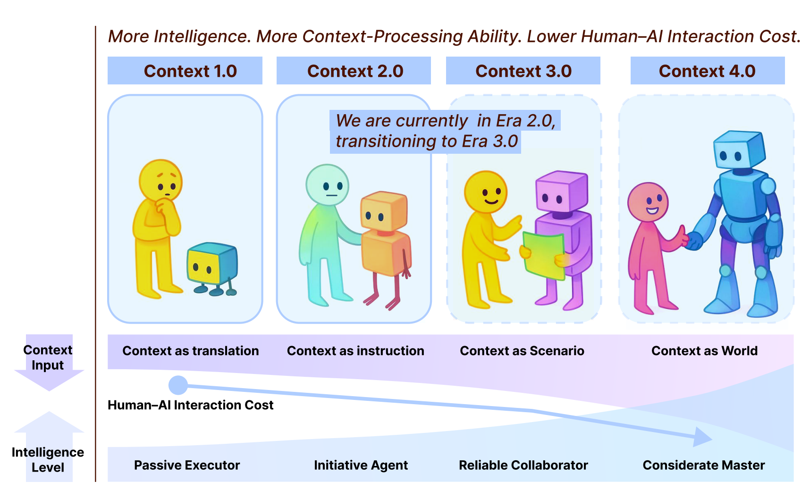

# 36. 什么是上下文工程

Manus 团队在《AI 代理的上下文工程：构建 Manus 的经验教训》中提到，打造智能体时面临一个根本抉择：是从头训练端到端的智能体模型，还是基于现有大语言模型（LLM）构建“上下文学习”能力？正是对“上下文”这一维度的深入反思，让他们最终押注于**上下文工程（Context Engineering）**。

当下智能体越来越需要多轮交互、状态追踪、对环境变化的感知与响应。若缺乏对上下文的系统化管理，智能体容易“丢链子”：记不住上一轮、误判当前状态、无法在复杂任务中持续推进。Manus 的实践表明：模型能力再强，若缺少结构化的上下文策略，潜力也会大打折扣。

本节按三条线索展开：**什么是上下文工程**、**从注意力机制到上下文工程**、**上下文工程的边界**。

## 一、什么是上下文工程

### 1. Context 的准确定义

在 Agent 和 RAG 里常听到“把检索结果放进上下文”“上下文太长会截断”——但**上下文（Context）** 究竟指什么？不少人会下意识地把 **Context 等同于“用户和模型之前聊过的所有话”**，即对话历史。这种理解在设计与排错时容易产生偏差。

- **在多轮对话中**：对话历史只是**构成上下文的一部分**，而非全部。同一次调用里还可能包含 System Prompt、检索到的文档、工具调用结果、当前轮用户输入等，它们**共同**组成本次调用时模型所见的内容。
- **在单次调用、无历史场景**（如一次性 RAG 问答）：没有“对话历史”，但**仍有上下文**——例如 System 指令 + 检索到的段落 + 用户问题。因此“上下文”的外延**大于**“对话历史”。

更准确的定义是：

> **Context（上下文）是指某一次调用 LLM 时，模型所能“看到”的全部输入内容的集合。**

因此：**对话历史只是上下文的可能组成部分之一**，二者不能画等号。

每次调用 LLM，模型在生成回复时能利用的**只有本次请求中传入的内容**。这些内容合在一起，就是该次调用的 **Context**。典型一次请求可能包含：

| 组成部分                     | 说明                              |
| ------------------------ | ------------------------------- |
| **System Prompt / 系统指令** | 规定角色、格式、规则等，通常置于最前或单独一段。        |
| **对话历史**（若有）             | 此前若干轮 user/assistant 消息，用于多轮连贯。 |
| **当前轮用户输入**              | 用户在本轮的问题或指令。                    |
| **注入的外部信息**              | RAG 检索到的段落、工具返回结果、当前时间、用户画像等。   |

以上内容会按一定顺序组织成一段或多段文本（或结构化消息），共同作为**本次调用的输入**。模型不会“记住”上一次请求的内容；只有在本次请求里**再次放入**的信息，才会进入本次的 Context。可归纳为：

> **Context = 一次 LLM 调用的全部可见输入。**

设计 Agent、RAG 或复杂工作流时，必须始终想清楚：**这一拍，模型眼前到底有哪些内容？** 哪些该进 Context、哪些不该进、以什么顺序进——这些正是**上下文工程**要解决的问题。

### 2. Context 与 Token Window 的硬约束

模型能接受的输入长度存在上限，一般用 **Token 数**表示（如 4K、8K、128K、200K），称为 **Context Window** 或 **Token Window**。一次请求中，System、历史、当前输入与注入内容的总 token 数**不得超过该上限**，否则会报错或被服务端截断。因此：Context 再重要，也受“能装多少 token”的**硬约束**；多轮对话与 RAG 都会占用量，若不主动做裁剪或压缩，很快就会超限。上下文工程的核心命题之一就是：**在有限的 token 预算内，如何把“最该让模型看到”的信息放进去，并控制总长度不超限。**

### 3. 上下文工程与提示词工程的区别

**提示词工程**主要解决单次输入时“怎么问、怎么答”——规定角色、格式和约束。**上下文工程**则让模型能够**记住并利用过去的信息**，关注多轮连续性与状态利用。前者侧重单次输入，后者侧重跨轮次的信息组织与利用，二者互为补充。

可以类比为和朋友聊天：聊了半小时后，朋友记得你之前说过的话、今天的计划和喜好；当你问“今晚吃什么”时，他能结合之前的聊天内容给出更贴心的建议。**上下文工程的目标，是让智能体具备类似能力**：

- 记住历史信息（用户说过什么、做过什么）；
- 结合当前任务进行判断；
- 管理不同任务或不同用户的上下文，避免混乱。

简而言之：**上下文工程让智能体有记忆、能利用环境与历史，不仅看当前输入，更懂过去与上下文。**

## 二、从注意力机制到上下文工程

要理解上下文工程的本质，可以从大语言模型的核心架构——**Transformer**——说起。Transformer 的关键思想来自《Attention Is All You Need》：**自注意力机制（Self-Attention）** 让模型在处理每个词时，都能动态地“关注”输入序列中与之最相关的部分。模型不再线性阅读，而是在整个上下文中分配注意力，从而形成理解。

在这一意义上，**上下文工程可以视为系统层面的注意力管理**：

- **Transformer 的注意力**是“微观”的：决定模型在输入序列**内部**该关注哪些 token。
- **上下文工程**是“宏观”的：决定系统在更高层次上该关注哪些**历史、任务、环境或工具**，以及以什么形式、什么顺序放入 Context。

在复杂智能体系统中，这种“宏观注意力”尤为关键：它帮助系统判断何时引用历史、何时忽略噪声、何时聚焦当下。若把 Transformer 比作微观的注意力调度器，**上下文工程就是宏观的注意力编排师**。

### 发展历程：上下文工程的阶段划分

GAIR-NLP 将上下文工程定义为**上下文的收集、存储、管理与利用**的工程过程，目标是缩小人类意图与机器理解之间的差距，并提出了四个发展阶段：

| 阶段             | 特征                                                             |
| -------------- | -------------------------------------------------------------- |
| **时代 1.0**     | 原始计算阶段：仅能处理结构化输入，对上下文处理能力有限；人机交互成本高，机器只能接受非常明确的上下文信息。          |
| **时代 2.0**     | 以智能体为中心：出现自然语言处理、大语言模型、多模态与模糊信息处理；机器智能提升，可容忍更高熵（更杂乱、非结构化）的上下文。 |
| **时代 3.0**（未来） | 类人智能：智能体开始理解与推理更复杂的上下文关系。                                      |
| **时代 4.0**（设想） | 超人智能：能处理极高复杂度与不确定性的上下文，实现超人级决策与理解。                             |

GAIR-NLP 指出，当前主流大语言模型（如 GPT-3 及后续版本）具备典型的 **2.0 特征**：能处理非结构化、含糊的输入；能进行主动推理；上下文不仅是“输入信息”，更可作为“指令或指导”。这意味着我们已处于**上下文工程 2.0**：智能体不仅能理解即时输入，还能利用上下文做出连续、智能的决策。

## 三、上下文工程的边界

明确上下文工程的**边界**，有助于在设计和排错时知道“它负责什么、不负责什么”，以及“一旦越界会发生什么”。

### 1. 硬边界：失控会直接导致推理失败

“上下文失控”可概括为：**该进 Context 的没进、不该进的进了、顺序混乱、或总长度失控**。任一种都会直接损害模型表现。

- **该进的没进**：关键信息（如检索到的最相关段落、上一轮的关键结论）未放入本次请求，模型就看不到，容易答偏、遗漏或重复提问；RAG 中若漏掉或截断答案所在段落，模型会“瞎答”或声称“无法从给定资料中得出”。
- **不该进的进了**：大量无关或低相关的内容占满 Context，会稀释关键信息，模型注意力被分散，容易抓错重点或混淆来源。
- **顺序不当**：许多模型对输入顺序敏感。若把当前用户问题放在很后面、前面堆满历史或长文档，模型可能“看不到”当前问题，或将历史中的某条误当作当前问题来答。
- **总长度超限或被截断**：超过 context window 时会被从一端截断；若被截掉的部分有关键前提或约束，推理就会基于不完整信息，出现逻辑错误、幻觉或违背指令。

因此：**上下文失控会直接导致推理失败。** 上下文工程的目标，就是在**可控、可用、不超限**的前提下，让每一次调用的 Context 尽可能支撑正确推理。

### 2. 能力边界：只负责“编排输入”

上下文工程**不替代**模型本身的推理与知识能力，只负责**把“该让模型看到什么”以什么形式、什么顺序放进 Context**。它不能解决：

- 模型知识缺失或能力不足（需依赖更好的模型、RAG 或微调）；
- 检索/工具返回错误或无关信息（需改进检索与工具链路）；
- 用户意图模糊或自相矛盾（需产品与交互设计）。

换句话说：**上下文工程是在给定模型与外部信息的前提下，把输入编排好；它不负责“信息从哪来、对不对”，也不负责“模型会不会用对”。** 明确这一边界，可以避免把“答错”“答不出”等问题全部归因或全部不归因于上下文设计，从而更精准地做优化。

## 小结

| 要点               | 说明                                                                                 |
| ---------------- | ---------------------------------------------------------------------------------- |
| **什么是上下文工程**     | Context ≠ 对话历史；Context = 一次调用的全部可见输入；受 Token Window 硬约束；与提示词工程互补，让智能体有记忆、能利用历史与环境。 |
| **从注意力机制到上下文工程** | Transformer 的注意力是微观（token 级），上下文工程是宏观（历史/任务/环境/工具的编排）；当前处于上下文工程 2.0 阶段。            |
| **上下文工程的边界**     | 硬边界：该进没进、不该进进了、顺序不当、超长截断都会导致推理失败；能力边界：只负责编排输入，不替代模型能力、不解决知识缺失或检索错误。                |
